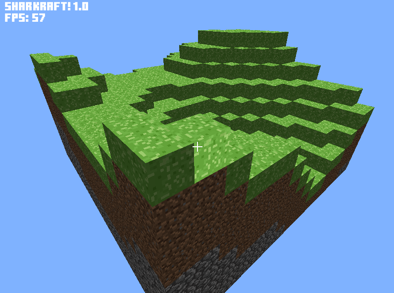
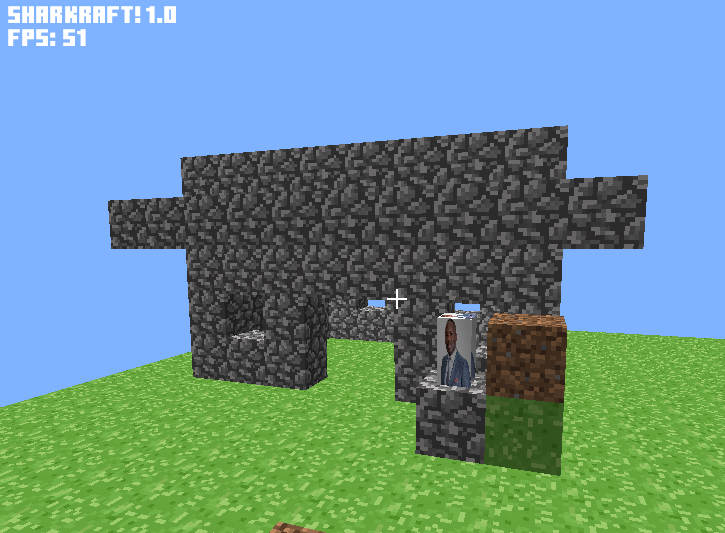

# Sharkraft

A minecraft-like game made with a custom voxel engine and world generation
Made using LWJGL
  
## ✨ Features
- Voxel cubes with 16x16 textures
- Custom perlin noise generator and world terrain generation
- Collision detector
- Basic lightning
- Simple player movements with a world reloader and 2 player modes: flying and walking
- Block placement and breaking system with block switching
- Basic physics for the player with friction, acceleration, falling and jumping
- Frustum and occlusion culling optimizations
  

## 🚨 Issues
- Bad performance optimization especially when rendering more than 4 chunks
- Lighting issues with shadows not rendering correctly
- Needs physics improvements
- Doesn't use vertix buffer objects
- Bad code structure

## 📷 Screenshots

